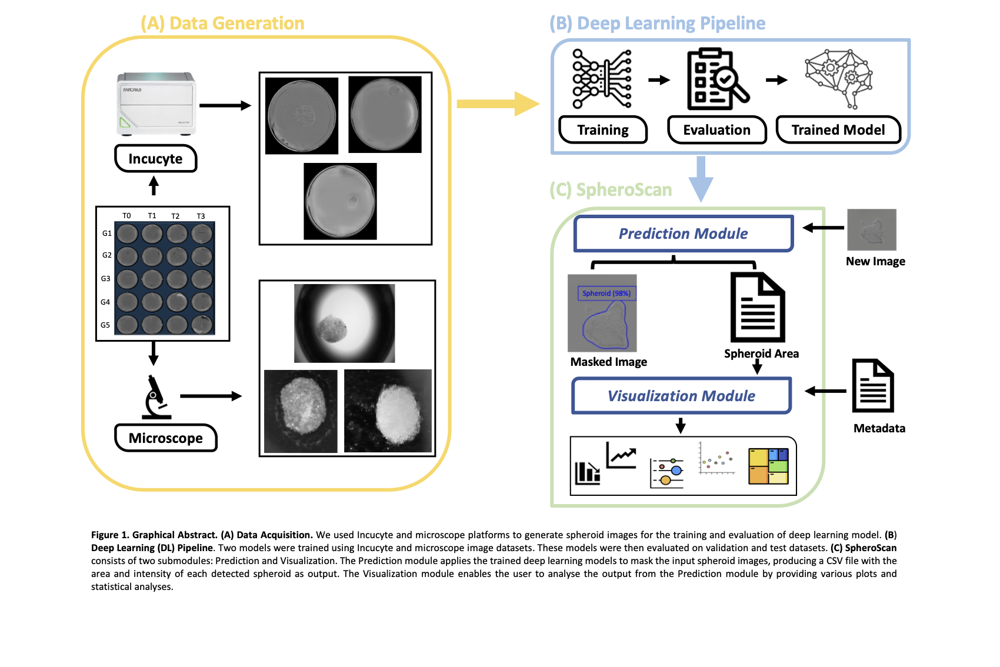
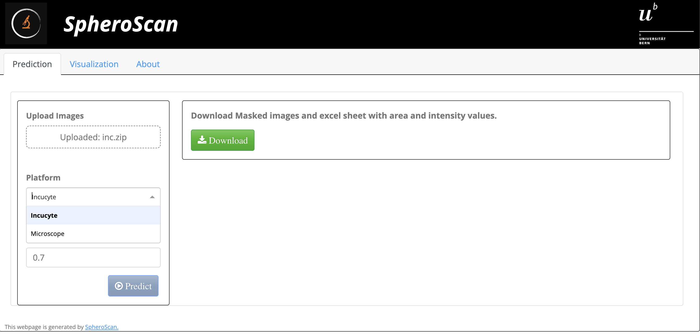
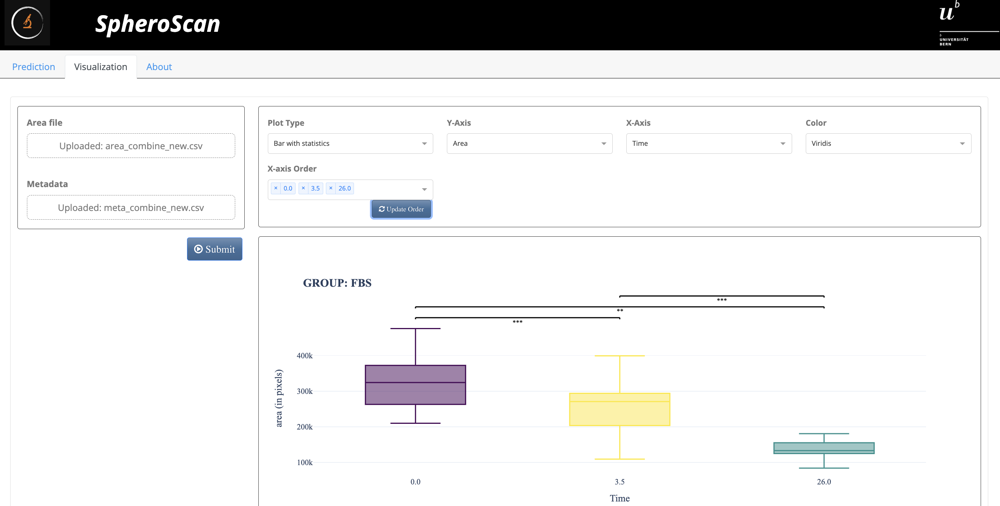

#  SpheroScan


#### Table of contents

- [Summary](#summary)
- [Demo Server](#demo-server)
- [Graphical Abstract](#graphical-abstract)
- [Prerequisite](#prerequisite)
- [Installation (via Docker)](#installation-via-docker)
- [Installation (from source code)](#installation-from-source-code)
    + [Download sourcecode and model weights.](#download-sourcecode-and-model-weights)
    + [Install dependencies](#install-dependencies)
    + [Re-run SpheroScan](#re-run-spheroscan)
    + [Errors you may encounter](#errors-you-may-encounter)
- [Example Input Data](#example-input-data)
- [Tutorial](#tutorial)
    + [**1. Prediction Module**](#1-prediction-module)
    + [**2. Visualization  Module**](#2-visualization--module)
    
# Summary
<div style="text-align: right"> SpheroScan is a user-friendly deep learning tool designed for analyzing images of spheroids. It uses state-of-the-art techniques to detect and segment spheroids, making it easy for researchers to process large amounts of data. This user-friendly, interactive tool is designed to streamline the process of spheroid segmentation, area calculation, and downstream analysis of spheroid image data, and can help to standardize and accelerate the analysis of spheroid assay results. SpheroScan consists of two main modules: prediction and visualization. The prediction module uses previously trained Deep Learning (DL) models to mask the input spheroid images and generate a CSV file with the area and intensity of each detected spheroid. The visualization module allows the user to analyze the results of the prediction module through various types of plots and statistical analysis. The plots generated by the visualization module are ready for publication and can be saved as high-quality images in png format. Overall, SpheroScan is a powerful and user-friendly tool that can greatly simplify and enhance the analysis of spheroid image data. </div> 

# Demo Server
We have set up a demo server for SpheroScan for demonstration purposes. Please  [click here](https://spheroscan.onrender.com/) to launch it. Please note that it may take a moment to load. <br><br> User can use the [example input data](#example-input-data) to test the visualization module. However, please note that the prediction module will not be available due to limitations on computational resources on the demo server.  

# Graphical Abstract
<p align="center"> </p> 

# Prerequisite 
  - To install SpheroScan, you will need to have a compatible operating system (Mac or Linux).  
  - Anaconda installed. You can follow the official Conda documentation (https://docs.conda.io/projects/continuumio-conda/en/latest/user-guide/install/index.html) to install Conda. Once installed, run the command ```conda list``` in your terminal to test your installation. You could follow [this tutorial](https://pythonsimplified.com/managing-python-virtual-environments-with-conda/) to learn more about conda. 
  - Git installed. Git is included as a default on many Mac and Linux systems. To confirm if it's installed on your machine, open the terminal and type ```git version```. If Git is not present, you can follow the official [Git guide](https://github.com/git-guides/install-git) to install the latest version.

# Installation (via Docker)
  1. **Prerequisite:** Before proceeding with the installation, ensure that Docker is installed and running. If you haven't installed Docker yet, you can follow the [official Docker tutorial](https://docs.docker.com/get-docker/) for installation instructions.
  2. To obtain the SpheroScan docker image, you may open your terminal and run the provided command.
       
       ```
       docker pull 45474547/spheroscan:latest                     
       ```
       
  3. To launch SpheroScan, please run the given command in your terminal after performing the previous steps.
       
       ```
       docker run -p 8080:80 45474547/spheroscan                     
       ```
       
  4. Paste http://localhost:8080/ in your browser to access SpheroScan.
       
       
# Installation (from source code)
  - #### Download sourcecode and model weights. 
    1. Download the SpheroScan GitHub repository from https://github.com/FunctionalUrology/SpheroScan and unzip it.
    2. Download the model weights ("weights.zip") from [here](https://zenodo.org/record/7552508#.Y8mkq-zMKsA). Move weights.zip file in the "SpheroScan-main" directory.
    
- #### Install dependencies  
    1. Open your terminal and change your current working directory to SpheroScan-main (e.g. ```cd path/to/SpheroScan-main/```). 
    2. Run following commands:  
       - Create a new Conda environment called ```my_env``` and activate it.
       ```
       conda create -n my_env                          
       conda activate my_env                           
       ```
       
       - Install Python (version 3.10.6)    
       ```
       conda install python=3.10.6                        
       ```
       
       - Install dependencies for SpheroScan
       ```
       pip install -r requirements.txt                     
       ``` 
       
       - Install detectron2  
       ```
       pip install 'git+https://github.com/facebookresearch/detectron2.git' 
       pip install packaging==21.3
       ```
 
       - Launch SpheroScan. It will be launched in a new web window, the time it takes to open may vary depending on computational resources.
       ```
       python main.py             
       ```


- #### Re-run SpheroScan
    1. Open your terminal and change the directory to the SpheroScan directory (e.g. ```cd path/to/SpheroScan/dir```). 
    2. Run following commands one by one:  
   
    ```
    conda activate my_env                            #activate previously created Conda environment
    python main.py                                   #It will open a web window and launch SpheroScan
    ```
- #### Errors you may encounter
  - ``` ERROR: pip's dependency resolver does not currently take into account all the packages that are installed. This behaviour is the source of the following dependency conflicts. detectron2 0.6 requires black==21.4b2, which is not installed.```.  
    - Possible solution: You can simply ignore this error.
  
  - ``` Address already in use. Port 4549 is in use by another program. Either identify and stop that program, or start the server with a different port.```.  
    - Possible solution: Before relaunching, please verify if you have a server already running for SpheroScan by checking your terminal and browser windows. If a server is already running, kindly close it.

  - ``` AttributeError: module 'packaging.version' has no attribute 'LegacyVersion'```.  
    - Possible solution: To fix this error, you can install an older version of the 'packaging' package using ```pip install packaging==21.3```
  
  
# Example Input Data
  - Prediction Module 
    - Microscope images - https://github.com/FunctionalUrology/SpheroScan/blob/main/example-Input-data/microscope_images.zip
    - Incucyte Images - https://github.com/FunctionalUrology/SpheroScan/blob/main/example-Input-data/incucyte_images.zip
  - Visualization Module 
    - Area file - https://github.com/FunctionalUrology/SpheroScan/blob/main/example-Input-data/area_file.csv
    - Metadata file - https://github.com/FunctionalUrology/SpheroScan/blob/main/example-Input-data/meta_file.csv
  - **Note:** If you are interested in using the SpheroScan for spheroid images from platforms other than incucyte/microscope and are willing to share images from your dataset, please contact the development team for further information.
      
# Tutorial

SpheroScan consists of following two main modules:  
### **1. Prediction Module**
The Prediction Module uses previously trained Deep Learning models to analyze spheroid images and generate a CSV file with the area and intensity of each detected spheroid.  
- Input <br><div style="text-align: right"> To use the prediction module, you must first upload a zipped folder containing your spheroid images. These images can be in .jpeg, .tif, or .jpg format from an Incucyte or microscope platform, but can also be from other platforms as long as there is only one spheroid per image and the background contrast is similar to Incucyte or microscope images.</div>
    
- Parameters 
  - **Platform Type:** Before running the module, user can choose the platform the images belong to (microscope or Incucyte) using platform dropdown.
  - **Prediction Threshold:** User can also set a prediction threshold (values between 0 and 1) from prediction threshold menu. A higher threshold results in better quality predictions but may not detect all spheroids.
      
- Output  <br> <div style="text-align: right">  Once the images are uploaded, you can click the submit button to begin the masking process. After the masking is complete, a download button will appear, allowing you to download the zipped result file. The result file includes all images with masked spheroids,  as well as two CSV files: "spheroidArea.csv" and "spheroidMeta.csv". <br><br>The spheroidArea.csv file generated by the Prediction Module contains the area and intensity information of each masked spheroid, and will serve as an input file for the Visualization Module to create plots and perform statistical analysis. <br><br>The "spheroidMeta.csv" file contains a list of image filenames and can be expanded to include additional metadata for use in the Visualization Module. </div> 
- Prediction Module Screenshot
<p align="center"> </p> 


***

### **2. Visualization  Module**
The Visualization Module enables the user to interpret the output of the Prediction Module by providing various types of graphical representations and statistical analysis. The plots generated by this module are suitable for publishing and can be exported as high-resolution images in PNG format.
  
- Input
  - **Area file:** <div style="text-align: right">The spheroidArea.csv file, generated by the Prediction Module, contains information about the area and intensity of each masked spheroid. An example of a area file is available for reference at https://github.com/FunctionalUrology/SpheroScan/blob/main/example-Input-data/area_file.csv.</div> 
  
  - **Metadata File:**  <div style="text-align: right"> A separate .csv file that includes additional information about the images in the Area File. The first column of the Metadata File, named ```filename``` should match the filenames in the Area File. Additionally, the Metadata File should contain at least two more columns that specify the group membership of each image. For example, these columns could indicate which treatment or time point the spheroid image belongs to. An example of a metadata file is available for reference at https://github.com/FunctionalUrology/SpheroScan/blob/main/example-Input-data/meta_file.csv. 
  <br><br> The "spheroidMeta.csv" file generated by the Prediction Module can be used as a starting point and expanded to create a comprehensive metadata file. </div>
 
- Parameters  
  - **Plot Type:** SpheroScan offers various visualization options to help users analyze the results of the Prediction Module. The Plot Type dropdown menu allows users to choose from six different types of plots, such as treemap, bubble plot, and line plot.
  
  - **Y-Axis:** The Y-Axis dropdown menu allows users to specify the parameter to be plotted on the y-axis of the chosen plot. Users can select between area, intensity, relative area or contraction.
  
  - **X-Axis:**  The X-Axis dropdown menu allows users to specify the grouping parameter to be plotted on the x-axis of the chosen plot. It contains all the grouping names (such as time point or group) provided in the metadata file and the user can select how to group the images. 
  
  - **Baseline:**  When relative area or contraction is selected on the Y-Axis, a Baseline dropdown menu will appear, allowing the user to select the group that should be used as the baseline group. The calculated relative area or contraction will be relative to that baseline group. 
  
  - **Color:** Users can also customize the color of the plot using the Color dropdown menu, which contains over 50 different color palettes. 
  
  - **X-axis Order:**  The X-Axis Order dropdown menu allows users to update the order of x-axis values. Once the order of x-axis values is selected, users should click on the "Update Order" button to apply the changes.
  
- Visualization Module Screenshot

<p align="center"> </p> 


***

- SpheroScan Plot Gallery <br> <br> SpheroScan provides the following types of plots and example plots can be viewed [here](https://github.com/FunctionalUrology/SpheroScan/tree/main/plot-gallery).  
  - **Bar Plot with significance level**: A bar plot with significance level is a visual representation of data where the level of significance is indicated by stars. Three stars (***) indicate a p-value of less than 0.001, while "ns" represents a p-value of 0.05 or greater. The less stars, the lower the significance level. <br>
  
  - **Bubble Plot**: A bubble plot is a type of scatter plot where the size of the bubbles represents the mean spheroid area for a certain group. The Y-axis displays the relative area or contraction of the spheroid, calculated with respect to a baseline group. <br>
  
  - **Treemap** A treemap is a method of displaying hierarchical data in which nested rectangles are used to represent different groups. The outer rectangles represent the top-level groups, while the inner rectangles represent sub-groups. The size and color of each rectangle in the treemap indicate the mean spheroid areas or intensity of the corresponding group.  <br>

  
  - **Line Plot** <br>
  - **Bar Plot** <br>
  - **Scatter Plot** <br>


